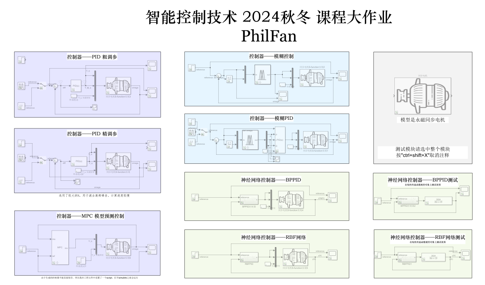

# 《智能控制技术》大作业——永磁同步电机调速



## 文件夹结构

**进入src打开Project.prj**

```
.
├── Report.pdf               # 大作业PDF报告
├── README.md                # 项目说明文件
├── assets                   # 存放图片资源的文件夹
├── report
│   ├── thesis.tex          # 主要的LaTeX源文件
│   └── thesis.pdf          # 生成的PDF报告
├── src                     # 源代码文件夹
│   ├── bppid.m            # BP神经网络PID控制器实现
│   ├── Fuzzy_Control.fis  # 模糊控制器设计文件
│   ├── Fuzzy_PID.fis     # 模糊PID控制器设计文件
│   ├── model.slx         # Simulink模型文件
│   ├── model.slxc        # Simulink缓存文件
│   ├── motor.m           # 电机模型实现
│   ├── mpccontroller.m   # MPC控制器实现
│   ├── Project.prj       # 项目配置文件
│   ├── rbfpid.m         # RBF神经网络PID控制器实现
│   └── test.fis         # 测试用模糊系统文件
└── reference               # 参考文献文件夹
    ├── 一种永磁同步电机无模型高阶滑模控制算法_赵凯辉.pdf  # 参考论文
    ├── 空间矢量坐标变换（等幅值变换） - 知乎.html        # 参考资料
    └── 空间矢量坐标变换（等幅值变换） - 知乎_files      # 参考资料附件
```

## 模型简介

详情请查看报告

**d轴电流方程**

$$
\frac{dI_d}{dt} = \frac{1}{L_d}(V_d - R_sI_d + \omega L_qI_q)
$$

**q轴电流方程**

$$
\frac{dI_q}{dt} = \frac{1}{L_q}(V_q - R_sI_q - \omega L_dI_d - \omega\psi_f)
$$

**转速方程**

$$
\frac{d\omega}{dt} = \frac{1}{J}(T_e - T_L - B\omega)
$$

**电磁转矩方程**

$$
T_e = \frac{3}{2}p(\psi_fI_q + (L_d - L_q)I_dI_q)
$$

**输入/输出/状态变量**

- **输入变量**：
  1. $V_d$：d轴电压（控制器输出）
  2. $V_q$：q轴电压（控制器输出） 
  3. $T_L$：负载转矩（扰动）
- **输出变量**：
  1. $\omega$：电机转速（rad/s）
- **状态变量**：
  1. $I_d$：d轴电流
  2. $I_q$：q轴电流
  3. $\omega$：电机转速
